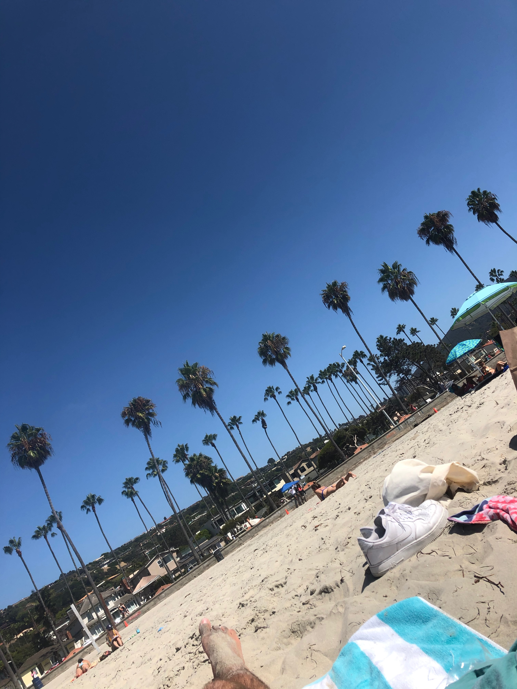
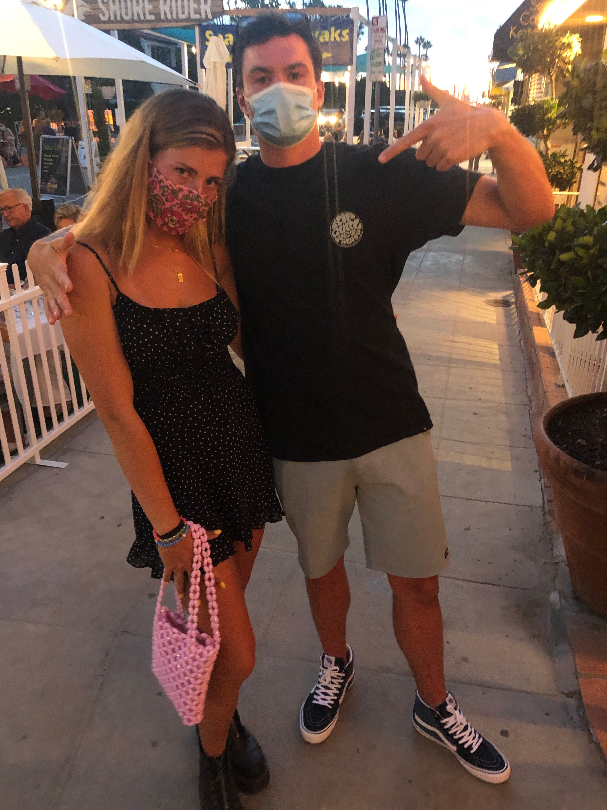
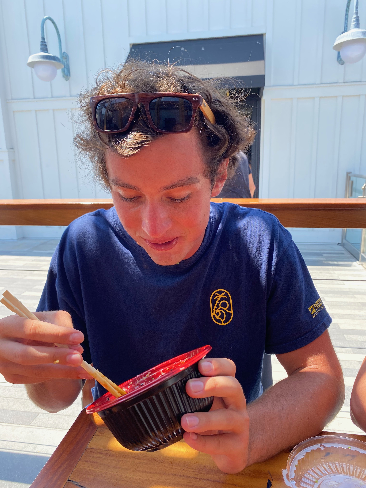

```{r setup, include=FALSE}
knitr::opts_chunk$set(echo = FALSE)
library(dplyr)
library(ggplot2)
library(tidyverse)
library(knitr)

source("source.R")
```

# Welcome To Logan and Connors San Dan Plan


### - Desire represents how badly we want to do each of the `r paste(total)` activities
### - Time represents our estimated time each activity will take in hours
##### -All things told we have `r paste(tot.time)` hours of activities, better not mess around down there.
### - Activites are listed to the right of the plot and correlate with colored dots on the plot

```{r graph, echo= FALSE}
plot_desire
```

### If that graphic doesnt make sense, here's a table
```{r table, echo = FALSE}
table
```
### You may think to yourself, you're only in San Diego for 5 days, do you have time for all this?
```{r pie, echo=FALSE}
pie
```
{width=26%}
{width=26%}
{width=26%}


